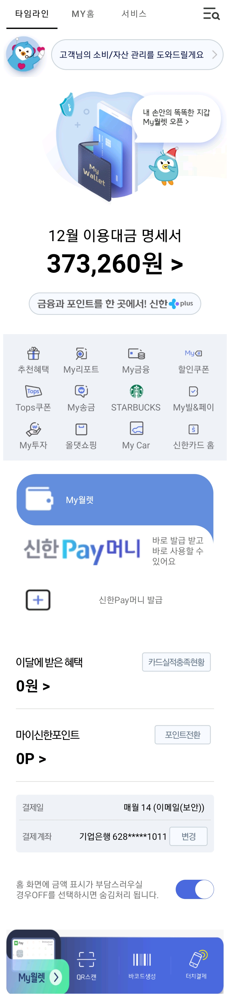
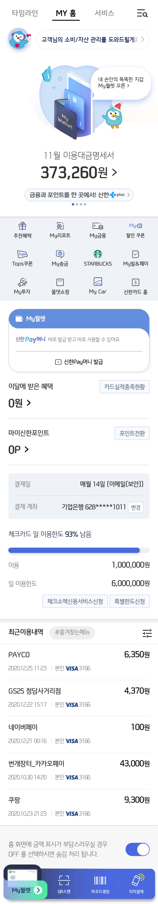

# Assignment of Week1
## 1. Manifest
> 본인의 기준으로 우선순위를 정하고 documentation 조사
### 역할
1. **앱 구성 요소 선언 (주요 역할) :**
   * Android System은 Activity, Service, BroadcastReceiver, ContentProvider와 같은 앱 구성 요소를 시작하기 위해 AndroidManifest.xml 파일을 읽어 해당 구성 요소가 존재하는지 확인합니다.
   * 따라서, 앱은 이 파일 안에 모든 구성 요소를 선언해야 합니다.
2. 모든 사용자 권한 식별 :
   * 앱이 요구하는 모든 권한 식별 (인터넷 액세스, 연락처 읽기 액세스 등)
3. 최소 API 선언 :
   * 앱이 어느 API를 사용하는지를 근거로 앱에서 요구하는 최소 API 레벨을 선언
4. HW/SW 기능 선언 :
   * 앱에서 사용하거나 요구하는 하드웨어 및 소프트웨어 기능 선언 (카메라, 블루투스, 멀티터치 화면 등)
5. API 라이브러리 선언 :
   * 앱이 링크되어야 하는 API라이브러리 선언 (Google Maps 라이브러리 등, Android 프레임워크 API는 제외)
### 앱 구성 요소 선언
 * &lt;activity&gt;
 * &lt;service&gt;
 * &lt;receiver&gt;
 * &lt;provider&gt;
### AndroidManifest.xml 주요 요소
1. &lt;manifest&gt; (필수, 유일)
   * AndroidManifest.xml 파일의 양 끝을 감싸는 루트 태그
   * 속성
     - 앱의 package name과 version 정보를 정의
2. &lt;application&gt; (필수, 유일)
   * application 태그 안에 컴포넌트 정보 및 앱에 대한 각종 정보를 정의
   * 속성
     - `android:label` : 앱의 label(제목) 정의
     - `android:icon` : 엡의 icon을 정의
3. &lt;activity&gt;
   * 포함된 위치
     - `<application>`
   * 포함 가능한 항목
     - `<intent-filter>, <meta-data>, <layout>`
   * 4대 컴포넌트 중에 Activity를 정의
   * 주요 속성
     - `android:name` : Activity class name 정의
     - `android:label` : Activity icon 재정의
     - `android:icon` : Activity label(제목)
4. &lt;intent-filter&gt;
   * 해당 컴포넌트가 어떤 암시적 intent를 처리하는지 정의
   * 포함된 위치
     - `<activity>`
     - `<activity-alias>`
     - `<service>`
     - `<receiver>`
   * 포함 필수 항목
     - `<action>` : 작업 처리 정의
   * 포함 가능한 항목
     - `<category>` : 컴포넌트 유형 정의
     - `<data>` : 컴포넌트 유형 정의
   * 속성
     - `android:label` : Intent icon 재정의
     - `android:icon` : Intent label(제목)
     - `android:priority` : Intent 우선순위 부여
5. &lt;service&gt;
   * Service 컴포넌트를 정의 (UI없는 백그라운드 작업 등 구현)
   * 포함된 위치
     - `<application>`
   * 포함 가능한 항목
     - `<intent-filter>, <meta-data>`
   * 속성
     - `android:name` : Service class name 정의
     - `android:label` : Service icon 재정의
     - `android:icon` : Service label(제목)
6. &lt;receiver&gt;
   * BroadcastReceiver 컴포넌트를 정의(앱 실행되고 있지 않을 때도 시스템이나 다른 앱에서 브로드캐스팅하는 인텐트를 앱에서 수신 가능)
   * 포함된 위치
     - `<application>`
   * 포함 가능한 항목
     - `<intent-filter>, <meta-data>`
   * 속성
     - `android:name` : BroadcastReceiver class name 정의
     - `android:label` : BroadcastReceiver icon 재정의
     - `android:icon` : BroadcastReceiver label(제목)
7. &lt;provider&gt;
   * ContentProvider 컴포넌트를 정의 (앱에서 관리되는 데이터를 인식)
   * 포함된 위치
     - `<application>`
   * 포함 가능한 항목
     - `<meta-data>, <grant-uri-permissions>, <path-permission>`
   * 속성
     - `android:name` : ContentProvider class name 정의
     - `android:label` : ContentProvider icon 재정의
     - `android:icon` : ContentProvider label(제목)
## 2. Palette
> *Fragment 조사는 선택 사항
* View와 ViewGroup
  * 눈에 보이는 요소 `Widget`, Widget을 담는 틀 `Layout`
* Common
   |분류|뷰 이름|특징
   |---|---|---|
   |Text|TextView|화면에 텍스트를 표시|
   |Buttons|Button|탭하거나 클릭하여 작업을 수행할 수 있는 Button, Java(혹은 Kotlin) 코드에서 setOnClickListener로 버튼 동작 정의 가능|
   |Widgets|ImageView|View의 속성을 상속받아 공간 안에 사진을 표시|
   |Containers|RecyclerView|스크롤이 가능한 컨테이너에 여러 개의 뷰를 담아서 보여주는 ViewGroup. *ListView 보다 진보하고 유연해진 버전 (ListView는 100개의 item이 있다면 100개의 view를 일일이 다 생성하지만 RecyclerView는 화면에 보여지는 일정 갯수의 view객체만 생성하고 스크롤 할 때마다 화면 밖으로 나간 view의 정보를 ViewHolder에 저장시켜놓고 해당 view객체들을 재활용)*
   |Containers|&lt;fragment&gt;|FragmentActivity 내의 어떤 동작이나 UI 일부 그리고 액티비티의 모듈식 섹션. 여러 개의 Fragment를 하나의 Activity에 결합하여 창이 여러 개인 UI를 빌드, 하나의 Fragment를 여러 Activity에서 재사용할 수 있음. 자체적인 수명 주기를 가지고 자체 입력 이벤트를 수신, 액티비티 실행 중에 추가 및 삭제가 가능 (다른 액티비티에 재사용할 수 있는 "하위 액티비티"와 같은 개념")|
   |Containers|ScrollView|수직(위아래)으로 스크롤 하는 위젯, 하나의 위젯만 가능|
   |Buttons|Switch|텍스트 오른쪽에 스위치 생성, 스위치는 두 가지 옵션 중에서 선택할 수 있는 2-state-togglem,  드래그하여 옵션을 선택하거나 탭하여 확인한 것 처럼 toggle 기능|
* Text
   |분류|뷰 이름|특징|
   |---|---|---|
   |Text|TextView|화면에 텍스트 표시|
   |Text|Plain Text|표준 텍스트 키보드 표시하는 TextView|
   |Text|Password|표준 텍스트 키보드 표시, 개인정보 보호를 위해 입력한 텍스트 숨김 처리(ex. ***)|
   |Text|Password (Numeric)|숫자 키보드 표시, 개인정보 보호를 위해 입력한 텍스트 숨김 처리|
   |Text|E-mail|스페이스바 왼쪽에 '@' 문자를 추가한 표준 텍스트 키보드 표시|
   |Text|Phone|전화번호 형식의 텍스트(ex. 000-000)를 입력하기 쉽도록 숫자 키보드 표시, '-' 문자 표시|
   |Text|Postal Address|우편번호 형식의 텍스트를 입력하기 쉽도록 키보드 맨 윗줄에 길게 탭했을 때 숫자 입력 지원|
   |Text|Multiline Text|새 줄을 추가하기 위해 Enter 키를 추가하여 표준 텍스트 키보드 표시|
   |Text|Time|시간 형식의 텍스트(ex. 12:00)를 입력하기 쉽도록 ':' 문자 추가하여 숫자 키보드를 표시|
   |Text|Date|날짜 형식의 텍스트(ex. 2021/01/01)를 입력하기 쉽도록 '/' 문자 추가하여 숫자 키보드를 표시|
   |Text|Number|기본 숫자 키보드 표시, '-', ',', '.' 등의 부호 입력 불가|
   |Text|Number (Signed)|기본 숫자 키보드 표시, 시작 시 양수 음수('+', '-') 문자 허용, 숫자를 입력하는 도중에는 '-'를 입력할 수 없고 이 외에 ',', '.' 부호 입력 불가|
   |Text|Number (Decimal)|기본 숫자 키보드 표시, 소수점('.') 문자 허용, '-'와 ',' 사용 불가 |
   |Text|AutoCompleteTextView|사용자가 입력하는 동안 자동완성 제안을 표시하는 Editable TextView, 제안 목록이 드룹 다운 메뉴에 표시되어 사용자가 편집 상자의 내용을 바꿀 항목을 선택|
   |Text|MultiAutoCompleteTextView|확장 가능한 Editable TextView, 전체 내용 대신 입력하는 텍스트의 하위 문자열에 대한 완성 제안을 표시|
   |Text|CheckedTextView|체크박스르르 제공하는 확장 TextViewMainActivity에서 setOnClickListener를 통해 체크박스의 체크와 해제 속성 부여 가능|
   |Text|TextInputLayout|텍스트를 입력하는 곳이 Layout의 속성을 가져 Layout 속성을 설정하듯이 속성을 설정|
* Buttons
   |분류|뷰 이름|특징|
   |---|---|---|
   |Buttons|Button|탭하거나 클릭하여 작업을 수행할 수 있는 Button, Java(혹은 Kotlin) 코드에서 setOnClickListener로 버튼 동작 정의 가능|
   |Buttons|ImageButton|사용자가 탭하나 클릭할 수 있는 ImageButton|
   |Buttons|ChipGroup|다수의 Chip을 관리하는 컴포넌트|
   |Buttons|Chip|워드 혹은 카테고리, 요소, 타입 등을 표현 할 때 종종 타원형의 background에 그 텍스트를 표현하는 Button|
   |Buttons|CheckBox|선택 또는 선택해제 할 수 있는 체크박스 유형의 상태 버튼|
   |Buttons|RadioGroup|RadioButton들을 모은 set에서 하나의 옵션을 선택, 사용자가 사용 가능한 모든 옵션을 나란히 볼 필요가 있다고 생각되면 상호 배타적인 옵션 set에 RadioGroup을 사용|
   |Buttons|RadioButton|원형으로 된 체크박스|
   |Buttons|ToggleButton|두 상태 사이에서 설정을 변경, 누르기 전 후 버튼 안의 텍스트 변경|
   |Buttons|Switch|텍스트 오른쪽에 스위치 생성, 스위치는 두 가지 옵션 중에서 선택할 수 있는 2-state-togglem,  드래그하여 옵션을 선택하거나 탭하여 확인한 것 처럼 toggle 기능|
   |Buttons|FloatingActionButton|UI 위에 원형의 떠 있는 듯한 버튼, 버튼을 활용하여 특수 동작 기능 정의|
* Widgets
   |분류|뷰 이름|특징|
   |---|---|---|
   |Widgets|View|Activity 내에서 공간을 설정, 그림 그리기 가능|
   |Widgets|ImageView|View의 속성을 상속받아 공간 안에 사진을 표시|
   |Widgets|WebView||View의 속성을 상속받아 특정한 URL과 연결된 뷰를 넣음, 각 OS별 내장된 웹 브라우저를 뷰 형태로 앱에서 표현|
   |Widgets|VideoView|View의 속성을 상속받고 Activity에 동영상을 표시|
   |Widgets|CalendarView|View의 속성을 상속받아 캘린더를 넣음, 탭과 클릭 이벤트로 날짜를 선택할 수 있으며 원하는 날짜로 달력을 스크롤하고 찾는 기능|
   |Widgets|ProgressBar|진행 상황을 표시할 수 있는 원형의 컴포넌트|
   |Widgets|ProgressBar (Horizontal)|수평으로 작업 진행률을 표시할 수 있는 컴포넌트, 왼쪽 끝에서부터 오른쪽으로 채워짐|
   |Widgets|SeekBar|드래그 가능한 thumb을 추가하는 ProgressBar의 확장 위젯, 연속적인 실선 위를 움직이며 왼쪽 또는 오른쪽으로 끌거나 화살표 키를 사용하여 현재 진행률 수준을 설정|
   |Widgets|SeekBar (Discrete)|불연속적으로 놓여있는 점 위를 움직이며 조절하는 컴포넌트|
   |Widgets|RatingBar|별표로 등급 혹은 만족도를 표시하는 SeekBar 및 ProgressBar의 확장 위젯|
   |Widgets|SearchView|검색어 입력 후 Search provider에게 검색을 요청할 수 있는 UI를 제공, 검색어 추천 리스트나 검색 결과 리스트를 보여주고 사용자는 해당 리스트에서 원하는 item을 선택하도록 정의|
   |Widgets|TextureView|비디오나 openGL과 같은 콘텐츠 스트림을 표시|
   |Widgets|SurfaceView|View 계층 구조에 포함된 형식과 크기의 제어가 가능한 전용 드로잉 표면을 제공|
   |Widgets|Horizontal Divider|수평선|
   |Widgets|Vertical Divider|수직선|
* Layouts
   |분류|뷰 이름|특징|
   |---|---|---|
   |Layouts|ConstraintLayout|평평한 구조를 가진 Layout, View에 대한 제약조건(Constraint)을 적용하여 각 뷰의 위치와 크기를 유연하게 조절|
   |Layouts|LinearLayout (horizontal)|서로 중첩되지 않고 지정된 방향으로 View가 쌓이는 Layout, 수평으로 View를 나열|
   |Layouts|LinearLayout (vertical)|서로 중첩되지 않고 지정된 방향으로 View가 쌓이는 Layout, 수직으로 View를 나열|
   |Layouts|FrameLayout|여러 View위젯을 자식으로 추가하면 겹쳐진 형태로 표시되며, 가장 최근에 추가된 View 위젯이 가장 상위에 표시, 이러한 특징을 이용해 가장 상위의 View 위젯만 표시하고 나머지는 보이지 않게 만듦으로써 하나의 자식 View만 표시|
   |Layouts|TableLayout|View를 행과 열로 나누는 테이블 형식으로 표시하는 Layout, TableLayout에 View위젯을 추가하기 위해서는 먼저 TableRow 클래스를 사용하여 하나의 행을 추가한 뒤 각 행에 View위젯을 추가하면 테이블 형태로 정렬되어 표시|
   |Layouts|TableRow|TableLayout에 추가되는 컴포넌트|
   |Layouts|Space|||
* Containers
   |분류|뷰 이름|특징|
   |---|---|---|
   |Containers|Spinner|여러 개의 값 중 1개를 선택하는 위젯|
   |Containers|RecyclerView|스크롤이 가능한 컨테이너에 여러 개의 뷰를 담아서 보여주는 ViewGroup. *ListView 보다 진보하고 유연해진 버전 (ListView는 100개의 item이 있다면 100개의 view를 일일이 다 생성하지만 RecyclerView는 화면에 보여지는 일정 갯수의 view객체만 생성하고 스크롤 할 때마다 화면 밖으로 나간 view의 정보를 ViewHolder에 저장시켜놓고 해당 view객체들을 재활용)*
   |Containers|ScrollView|수직(위아래)으로 스크롤 하는 위젯, 하나의 위젯만 가능|
   |Containers|HorizontalScrollView|수평(좌우)으로 스크롤 하는 위젯|
   |Containers|NestedScrollView|한 화면에 여러개의 스크롤을 사용|
   |Containers|ViewPager2|RecyclerView를 기반, ViewPager에서는 좌우 스크롤링만 가능, 상하 스크롤링 기능을 추가|
   |Containers|CardView|FrameLayout 클래스를 확장, 둥근 모서리, 배경과 그림자가 추가된 FrameLayout|
   |Containers|AppBarLayout|LinearLayout 머리티얼 디자인 앱 바 개념의 많은 기능, 즉 스크롤링 제스처를 구현하는 카테고리|
   |Containers|BottomAppBar|.NET Framework를 "cradles"시키는 모양의 배경을 지원하는 툴바의 확장|
   |Containers|NavigationView|앱의 표준 탐색 메뉴, 내용은 메뉴 리소스 파일로 정의|
   |Containers|BottomNavigationView|NavigationView가 하단에 위치|
   |Containers|Toolbar|응용 프로그램 콘텐츠 내에서 사용하기 위한 표준 도구 모음|
   |Containers|TabLayout|탭을 표시하기 위한 가로 레이아웃|
   |Containers|TabItem|TabLayout 레이아웃 내에서 탭 항목을 선언할 수 있는 특수한 뷰, TabLayout에 추가되지 않으며 탭 항목의 텍스트, 아이콘 및 사용자 정의 레이아웃을 정의|
   |Containers|ViewStub|Runtime에 레이아웃 리소스를 느리게 확장하는데 사용할 수 있는 크기가 0인 보이지 않는 뷰|
   |Containers|&lt;include&gt;|레이아웃에 재사용 가능한 컴포넌트 추가|
   |Containers|&lt;fragment&gt;|FragmentActivity 내의 어떤 동작이나 UI 일부 그리고 액티비티의 모듈식 섹션. 여러 개의 Fragment를 하나의 Activity에 결합하여 창이 여러 개인 UI를 빌드, 하나의 Fragment를 여러 Activity에서 재사용할 수 있음. 자체적인 수명 주기를 가지고 자체 입력 이벤트를 수신, 액티비티 실행 중에 추가 및 삭제가 가능 (다른 액티비티에 재사용할 수 있는 "하위 액티비티"와 같은 개념")|
   |Containers|NavHostFragment|자체 포함된 Navigation이 발생할 수 있도록 레이아웃 내에 영역을 제공|
   |Containers|&lt;view&gt;|다른 view들을 포함하고 있거나 포함할 수 있는 View, 일반적으로 ViewGroup을 상속하면서 Layout이 아닌 클래스를 지칭|
   |Containers|&lt;requestFocus&gt;|해당 View를 Focus|
* Helpers
   |분류|뷰 이름|특징|
   |---|---|---|
   |Helpers|Group|||
   |Helpers|Barrier (Horizontal)|||
   |Helpers|Barrier (Vertical)|||
   |Helpers|Flow|||
   |Helpers|Guideline (Horizontal)|||
   |Helpers|Guideline (Vertical)|||
   |Helpers|Layer|||
   |Helpers|ImageFilterView|||
   |Helpers|ImageFilterButton|||
   |Helpers|MockView|||
* Google
   |분류|뷰 이름|특징|
   |---|---|---|
   |Google|AdView|View 배터 광고를 표시하는 API|
   |Google|MapView|Google Map 서비스에서 얻은 데이터와 함께 지도를 표시하는 API|
* Legacy
   |분류|뷰 이름|특징|
   |---|---|---|
   |Legacy|GridLayout|2차원의 행과 열로 구성된 Layout, 인덱스로 참조되며 좌상단에서부터 (0, 0) 좌표 값으로 시작. TableLayout과 유사하나 자식View를 순서대로 배치하기 때문에 LinearLayout과 유사한 점이 더 많음. GridView와 다르게 스크롤 불가, 화면구조 정의만|
   |Legacy|ListView|||
   |Legacy|TabHost|||
   |Legacy|RelativeLayout|어떤 View와의 상대적인 위치를 지정하는 Layout, RelativeLayout의 자식View들에 상대적 배치 기준을 지정하지 않는다면, RelativeLayout 내부에서 중첩되어 표시|
   |Legacy|GridView|2차원 스크롤 격자의 항목을 표시하는 ViewGroup, ListAdapter를 이용하여 데이터를 가져오기에 Adapter를 통하지 않고 다른 데이터 입력 불가. GridLayout과 다르게 자동 스크롤|
## 3. Layout
> Linear, Relative, Frame, Table, Grid, Constraint 6가지 Layout 조사
1. Linear Layout
   * 세로 또는 가로의 단일 방향으로 모든 하위 요소를 정렬하는 뷰 그룹. 왼쪽 위부터 아래쪽 또는 왼쪽에서 오른쪽으로 차례로 배치
   * 특징
     * 요소에 가중치 할당 지원 (width와 height 0dp로 한 뒤, weight "1"로 설정)
   * 규칙
2. Relative Layout
   * 위젯 자신이 속한 레이아웃의 상하좌우의 위치를 지정하여 배치
   * 특징
     * 중첩된 ViewGroup을 없애고 레이아웃 계층 구조를 평면으로 유지하여 성능을 개선, UI 설계에 매우 유용
3. Constraint Layout
   * 평평한 구조를 가진 Layout. View에 대한 제약조건(Constraint)을 적용하여 각 뷰의 위치와 크기를 유연하게 조절. 복잡한 레이아웃을 깊은 계층을 가지지 않고 배치
   * 특징
     * 레이아웃 사이의 관계에 따라 배치가 결정된다는 점에서 `RelativeLayout`과 유사하지만, `RelativeLayout`보다 유연하고 Android Studio의 Layout Editor와 함께 사용하기가 더 쉽기에 개발자가 인터페이스를 더욱 풍부한 방식으로 표현할 수 있다.
   * 규칙
     * 가로와 세로 하나씩 두 개 이상의 제약조건이 필요
   * 크기 조정 방법
      {:width="50%" height="50%"}
      1. 크기를 비율로 설정 (toggle aspect ratio constraint)
         * 너비:높이 입력
      2. 제약조건 삭제
      3. 높이/너비 모드
         1. 고정 (fixed) 
            * view의 크기를 지정
         2. 콘텐츠 래핑 (wrap content) 
            * view가 콘텐츠에 맞게 필요한 만큼만 확장
          1. 제약조건과 일치 (match constraints) 
            * view가 양쪽의 제약조건에 맞게 최대한 많이 확장
      4. 여백
      5. 제약조건 편향 제어
      6. 제약조건 목록에서 개별 제약조건을 강조 가능
4. Frame Layout
   * 위젯을 왼쪽 위에 일률적으로 겹쳐서 배치하여 중복되어 보이는 효과를 냄. 여러 개의 위젯을 배치한 후 상황에 따라서 필요한 위젯을 보이는 방식에 주로 활용
5. Table Layout
   * 위젯을 행과 열의 개수를 지정한 테이블 형태로 배열
6.  Grid Layout
   * 테이블 레이아웃과 비슷하지만, 행 또는 열을 확장하여 다양하게 배치

## 4. Layout 화면 구축
> 3번의 Layout 전부 활용하여 실제 Product 수준의 화면 구축
* [PaymentLayout link](https://github.com/yezji/RisingProgrammer/tree/main/Week1/PaymentLayout)
* |result|reference|
  |------|---------|
   ||
