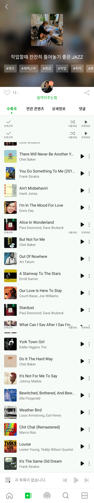

# Assignment of Week2

<!-- TOC -->

- [Assignment of Week2](#assignment-of-week2)
  - [Activity LifeCycle, Intent](#activity-lifecycle-intent)
    - [MusicApp](#musicapp)
    - [Result](#result)

<!-- /TOC -->

## Activity LifeCycle, Intent
> Activity LifeCycle, Intent를 모두 활용해서 앱 만들기 (화면 전환 및 데이터 주고받기 포함)

### MusicApp
#### goal

* Activity의 life cycle에 따라 음악 재생 보이기
* Intent를 활용한 음악 실행과 화면 전환

#### functions

* onCreate()

  역할 :  UI 리소스 초기화/복원 처리, View 생성 처리

  *  Activity가 비정상적으로 종료되었을 때 onSaveInstancneState()로 최근에 듣던 곡 저장 UI 리소스 초기화/복원
    * *비정상적 종료란?
      뒤로가기 키를 눌러 Activity 종료한 경우, 시스템의 메모리가 부족해 OS가 Activity를 강제 종료한 경우, 언어 설정을 변경한 경우, 화면 회전, 폰트의 크기나 글씨체 변경한 경우
  * Fragment BackStack 초기화
    * Bottom navigation view의 메뉴를 누를 때 마다 스택에 버튼이 쌓이는 것을 방지하기 위해 FragmentTransaction 관리하기 위한 메서드 정의

* onRestart()

  역할 : Activity 재시작할 때 호출되며 보통은 아무것도 하지 않아도 된다고 함

  * 서비스가 틀고 있는 음악의 화면 보이기 기능

* onStart()

  역할 : 통신(컴포넌트 간도 가능)이나 센서처리를 시작, Activity가 포그라운드로 전환되어 상호작용을 준비

  * 음악 재생 시 재생 상태(play, pause..)에 따라 버튼 모양을 번경하여 UI 반영
  * bindService()로 통신하여 Service에 바인드하는 방법을 사용

* onResume()

  역할 : focus가 떠날 때까지 상호작용 (ex. 카메라 미리보기 시작 기능)

  * 전화나 다른 앱으로 가려진 뒤 재개될 때 새로고침
  * RecyclerView/ListView 새로고침 (notifyDataSetChanged)

* onPause()
  
  역할 : 저장하기에는 시간이 짧기에 배터리 수명에 영향을 미치는 모든 리소스를 해제 (데이터 저장X, 네트워크 호출X. 데이터베이스 트랜잭션X -> 저장시간 긴 것들은 onStop()에서 수행)
  * 배터리 수명에 영향을 미치는 모든 리소스 해제(GPS와 같은 센서 핸들..)
  * 완전히 앱 화면이 꺼져도 셋팅 값 저장해두었다가 살리기

* onStop()

  역할 : 전화나 다른앱으로 Activity가 완전히 가려질 때, 저장 시간 긴 영구 데이터들을 저장

  * 영구데이터 저장 (ex. 사용자 기본 설정, 데이터베이스 데이터)
    * Activity가 포그라운드에 있을 때 저장하거나, onStop()메서드에서 저장
  * 화면이 보이지 않을 때 종료되어야 하는 서비스라면 onStop()에서 서비스 통신 객체 연결 해제

* onDestroy()

  역할 : 아직 해제되지 않은 모든 리소스, Activity 참조들 모두 해제

  * Fragment BackStack 메모리 해제
  * 쓰레드 해제 (android.os.Debug.stopMethodTracing() 등)

#### layouts

* bottom navigation view로 5개의 fragment 페이지를 구성
  1. home
  2. **trend chart (주요 기능)**
  3. broadcast
  4. search
  5. drawer

* 회원가입 -> Room 사용해 데이터베이스 만들고 쿼리로 계정 id 유효성 체크

---

### Result

* [MusicApp code link](,,,)

| activity name || result                                      | reference                                                  |
| ------------------------------------------- | ------------------------------------------- | ---------------------------------------------------------- | ---------------------------------------------------------- |
|chart|  |  |
|login||없음 (새로 만듦)|
|register||없음 (새로 만듦)|
