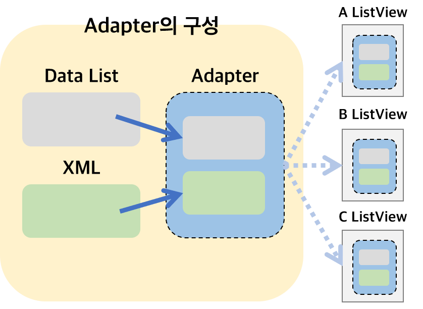

# Summary of Week3
## Review of Assignment2

### 앱 만들기
* 클라이언트 안에서 유효성 체크해주는게 서버의 부하를 막는다.
  * 중복성체크, 유효성체크, 정규식
* 텍스트 입력 시 키보드 가려질 때?
  * 라이브러리 지원이나 높이 계산해서 작성

---

## ListView, RecyclerView 개념

### ListView

* 구성
  * Adapter(Data + XML)

* 왜 ListView가 만들어졌을까?
  
  * 불편함의 발견
  
      1. 반복적인 재사용의 불편
      2. 인덱스 관리가 불편
      3. 잦은 데이터의 삽입, 삭제로 인한 불편 
  * 불편함 해결?
    * 내가 ListView를 만들어본다면 어떤 기능이 필요할까?
    * getter, setter
      * 좌표 설정, 사이즈 변수
      * 데이터 클래스 만들어서 ArrayList&lt;Data&gt;처럼 리스트 형태로 관리
      * iterator, 인덱스 관리, 삽입삭제 및 순서 재배치 함수
      * ... 등
  * **BUT, ListView가 너무 무거워졌다!**
* 최적의 해결
  * **Adapter Pattern을 사용해 View를 분리**해서 결합도를 낮추자!
  * View를 분리하니 확장이 용이해지는 장점이 생겼다!

##### Adapter

* 일반적 의미
  * 장치 또는 기계의 다른 부분을 연결하는 장치
  * 노트북 어댑터가 전기를 변환해서 쓸 수 있는 형태로 가공하는 것과 같은 역할
* Android에서의 역할
  * ListView에 데이터를 추가하여 화면에 표시하기 위한 객체
  * Data List(사용자 데이터)와 xml(화면 출력 View) 두개의 부분을 이어주도록 View를 만드는 객체

###  

### RecyclerView

* 구성
  * Adapter(Data+XML) + **LayoutManager**
  * ViewHolder 패턴 추가