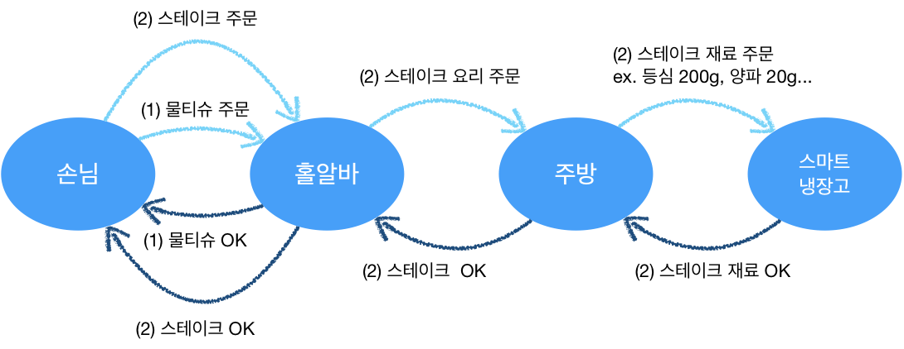
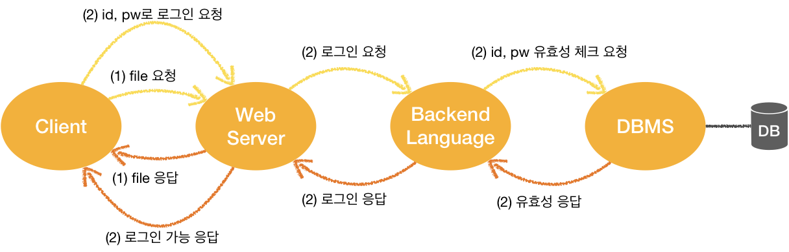
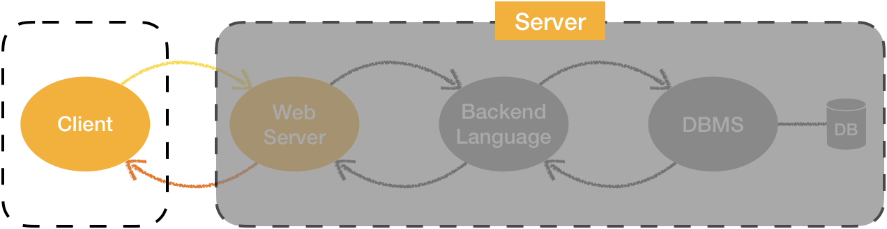

# Summary of Week5
## Review of Assignment4

### Thread
* 상태 체크를 Thread로 돌리는 것은 무의미 하다.
* Handler를 통해 전역 변수에 넣고 필요할 때만 비교하는게 효율적!

### 클래스 여러번 재사용

* 네트워크 라이브러리같이 여러번 재사용할 때
  * manifest 안에서 name으로 불러서 사용하기 (companion object처럼..)
  * SharedPreferences 사용 시 자주 활용되는 방법

---

## Network & API 개념

### Network

* 서버란?

  * 단어의 특징
    
  * server : serve + er (= 제공자, 홀알바와 같은 역할)
    
  * 하는 일 (홀알바에 빗대어 작성)

    * 요청 오면 주문 받고 전달, 신속 정확, 친절하게
    * 최적의 서비스 환경 제공 (24시간 죽지 않는/ 응답 요청 속도가 빠른..)
    * 청소, 대기 (쓰레드풀, 메모리 관리)
    * 손님 관리와 대기번호 발급, 모니터링 (게임 접속 대기열 처리 / 손님 나가기 기다렸다가 테이블 치우기, 가만히 있는 손님 내보내기, 세션 로그아웃)
    * 진상퇴치 (DDOS, SQL Injection, 해킹, 스미싱 같은 위험으로부터 데이터 보호)

  * 비교

    

    

     * Backend Language
       	* PHP (라라벨 프레임워크)
          	* ASP (닷넷 프레임워크)
       	* JSP (스프링, 스프링 부트 프레임워크)
       	* Python (장고 프레임워크)
       	* JavaScript (Node js, Vue js 프레임워크)
     * Backend Language는 주방장의 칼과 같다고 비유한다.
       	* 어떤 칼로 썰어도 음식은 만들어지지만
          	* 정교하게 썰어야할 떄는 일식도 사용하는 방법 선택

  * 컴퓨터 서버와 홀알바 서버의 관통하는 특징?

    * 1 : N으로 서버가 다수의 클라이언트를 대응

  * 서버의 역할

    * 서버는 어떻게 사용하느냐에 따라 서버가 될 수도 있고, 클라이언트의 역할을 수행할 수도 있다.

  * 클라이언트는 서버가 어떻게 돌아가도 되는지 몰라도 된다.

    

    * 손님이 홀알바나, 주방에 대해 아무것도 몰라도 스테이크를 먹을 수 있듯이!
    * 손님은 스테이크를 **주문(=요청)하는 방법만** 알면 된다.

* 요청을 위해 클라이언트에서 알아야 할 것

  1.  가게의 주소 ( = 서버 컴퓨터의 IP 주소)
  2. **최신 메뉴판** ( = API 명세서)
     * 클라이언트와 서버 간 상호작용을 위해 꼭 필요한 것!!
  3. 주문 방법 ( = 프로토콜)
     * 선불, 후불, 키오스크 주문, 자리에서 주문과 같이 주문 방법이 다양한 것처럼 프로토콜에도 종류가 다양하다.
     * 프로토콜 종류 : HTTP, HTTPS, FTP, SSH
     * 프로토콜의 뜻 : 통신규약, 약속

---

### HTTP 프로토콜

* HTTP는 웹/앱에서 자주 사용

* HTTP로 주고 받을 때

  * **패킷** 안에 header, body 담아 주고 받음
  * header에는 url이라던지 metadata가 들어감
  * body에는 실제 유효한 값, 중요한 내용에 대한 값들이 들어감
  * 그래서 네트워크 통신 중 패킷을 갈취당하면 다 노출되게 된다.
    * 해결 방법? 패킷에 금고를 씌워버린 HTTPS(HTTP + Secret) 사용

* HTTP 데이터 전달 방법

  * HTTP Method 사용!

    * GET, POST, PUT, PATCH, DELETE
      * GET 메서드는 데이터 보낼 때 사용하면 X, 조회 O!!
        데이터 보내는건 검색 결과를 받아오기 위함!
      * GET과 POST의 차이?
        * 단순히 보내는 방법의 차이가 아니다!
        * GET은 노출되도록 설계되었고, POST는 노출되지 않도록 설계된 메서드이다.
        * GET은 조회를 위해 설계되었고, POST는 생성을 위해 설계되었기 때문이다.

  * [방법 1] Query string

    * /users?userid="1234"&keyword=""
    * 노출 O

  * [방법 2] Path variable ✅

    * /users/1
    * /users/:userid 또는 /users/{userid}
    * 노출 O

  * [방법 3] Body

    * 패킷의 body에 담는 방법 2가지

      1. raw : 날것의 string 타입

         1. XML (태그 형식)
         2. JSON (객체로 묶은 형식) ✅
            1. JSON Object와 Jason Array 구분하기

         * XML과 JSON의 차이?
           * XML 태그에서는 이름을 시작 태그, 끝 태그 두번씩 사용하기에 길이가 JSON에 비해 두배 많음
           * JSON에서는 객체 하나에만 이름 사용
             * 또한, 바로 클래스로 매핑 가능하다는 장점!

      2. form-data : key-value 타입

    * 주의! GET 메서드는 body로 하면 안된다!